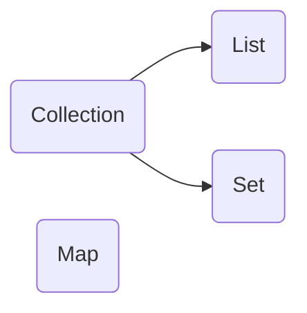

### 데이터군을 저장하는 클래스들을 표준화한 설계

- Collection interface

### Collection interface method

- boolean add(Object o) 
	- addAll(Collection c)
- void clear()
- boolean contaions(Object o )
	- contaionsAll(Collection c)
- boolean equals(Object o)
- int hashCode()
- boolean isEmpty()
- iterator iterator()
- boolean remove(Object o)
	- boolean remaoveAll(Collection c)
 - boolean retainAll(Collection c) : c의 객체만을 남기고 삭제. 변화여부 반환
 - int size()
 - Object[] toArray()
	 - Object[] toArray(Object[] a)
	 - 

---

| List | Set | Map |
|:------:|:---:|:---:|
|순서O 중복 O|순서X 중복 X|key + value 순서 X ,Key만 중복 X|
|ArrayList/ LinkedList, Stack|HashSet, TreeSet|HashMap, TreeMap, Hashtable|

### List interface method

- void add(int index Object e)
	- boolean addAll(int index,  Collection c)
- Object get(int index)
- int indexOf(Object o)
	- int lastindexOf(Object o)
- ListIterator listIterator() 
	- (int index)
- Object remove(int index)
- Object set(int index,Object e)
- void sort(Comparator c)
- List subList(int fromIndex, int toIndex)

---

### Map interface method

- void clear()
- boolean containsKey(Object key)
- boolean containsValue(Object value)
- Set entrySet()
- boolean equals(Object o)
- Object get(Object key)
- int hashCode()
- Set keySet()
- Object put(Object key, Object value)
- void putAll(Map t)
- Object remoce(Object key)
- int size()
- Collction values()

### Map.Entry interface

- boolean equals(Object o)
- Object getKey()
- Object getValue()
- int hashCode()
- Object setValue(Object value)

---

### ArrayList

### LinkedList

### Stack

### Queue

#### PriorityQueue

#### Deque

---

### Iterator

#### ListIterator

### Enumeration

---

### Arrays

---

### Comparator

#### Comparable

---

### HashSet

### TreeSet

---

### HashMap

### Hashtable

##### hashing
- 해시함수를 이용해서 데이터를 해시테이블에 저장하고 검색

### TreeMap

### Properties

---

## Collections synchronization
- 멀티 쓰레드 프로그래밍에서는 하나의 객체를 여러 쓰레드가 동시에 접근가능
- 데이터의 일관성(consistency) 유지 위해 동기화가 필요

---

