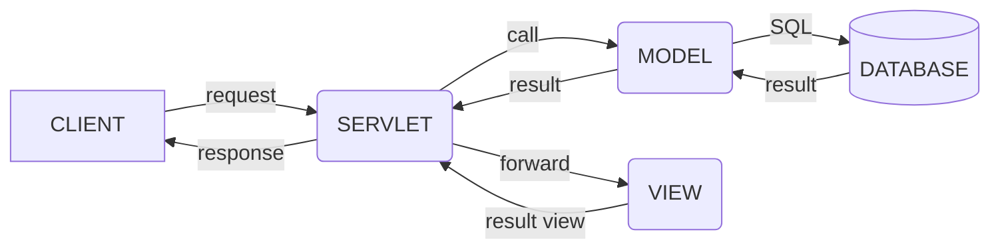

### IOC (Inversion of Control)
- 사용자가 제어의 흐름을 선택하지 않고 특별한 객체에 위임

### DL (Dependency Lookup)
- 컨테이너에서 제공하는 API를 이용하여 사용하고자 하는 빈을 검색
### DI (Dependency Injection)
- 각 클래스 사이의 필요로 하는 의존관계를 빈 설정 정보를 바탕으로 컨테이너가 자동 연결

#### POJO (Plain Olld Java Object)
- getter / setter를 가진 단순 자바 오브젝트
- 의존성이 없어 유연.
#### AOP (Aspect Oriented Programming)
- 관점 지향 프로그래밍
- 중복되는 코드 / 공통기능을 한 곳에 보관. 재사용성 극대화.

---


### MVC (Model View Controller) (Model2)
- 사용자 인터페이스와 비즈니스 로직을 분리하여 개발



#### Model
- Service / DAO / Java Beans
- Logic 처리를 담당. Controller로 부터 넘어온 data 이용, return
- Model에서는 View와 Controller의 정보를 가지고 있으면 X
#### View
- JSP
- 화면처리를 담당. Client 요청에 대한 결과 / controller에 요청을 보내는 화면단
- Model이 가진 정보를 저장 X Model , Controller 의 구성요소 X
#### Controller
- Servlet
- Client 요청을 분석하여 Model 호출
- 필요에 따라 request, session 등에 결과data 저장, redirect / forward 방식으로 jsp page 이용 출력
- Model , View 의 정보 O

---

#### Spring Core
- Spring Container. 
- Bean Factory Container는 IOC패턴을 적용하여 객체 구성/ 의존성 처리 등 

#### Spring Context
- context 정보들을 제공하는 설청 파일. 

#### Spring AOP

#### Spring DAO
- Data Acess Object : database에 접근하는 객체.
- Spring JDBC DAO는 추상 레이어를 지원하여 간편화

#### Spring ORM
- Object relational mapping 

#### Spring Web
- Web context module은 Application module에 내장.
- Web 기반의 응용프로그램에 대한 Context를 제공
- Jakarta Structs와의 통합 지원

#### Spring MVC
- Model2 구조 지원
- 전략 인터페이스를 통해 고급 구성 가능
- JSP, Velocity, Tiles , iText, POI 등 View 기술 지원

----


### 원격 프로그램 실행
1. 프로그램 등록
2. URL과 프로그램을 연결
```java
package com.fastcampus.ch2;

import org.springframework.stereotype.Controller;
import org.springframework.web.bind.annotation.RequestMapping;

@Controller  // 1
public class Hello{
 
	@RequestMapping("/Hello") // 2
	public void main(){
		System.out.pringln("Hello");
	
	}
}
```

---

### Maven

#### pom.xml

---

### 디자인 패턴
- 특정 문맥에서 공통적으로 발생하는 문제에 대해 쓰이는 재사용 가능한 해결책
- 대표적으로 GoF의 23개 패턴
- 목적에 따라 생성 / 구조 / 행동으로 분류

#### 생성 패턴
- 객체의 생성과 관련된 패턴
- 특정 객체가 생성되거나 변경되어도 프로그램 구조에 영향을 최소화

생성 패턴 | 의도
--- | ---
Abstract Factory| 구체적인 클래스를 지정하지 않고 인터페이스를 통해 연관되는 객체들을 묶음
Builder| 객체의 생성과 표현을 분리하여 객체를 생성
Factory Method| 객체 생성을 서브클래스로 분리하여 위임(캡슐화)
Prototype| 원본 객체를 복사하여 객체를 생성(클론)
Singleton| 한 클래스마다 인스턴스를 하나만 생성하여 어디서든 참조


#### 구조 패턴
- 프로그램 내 자료 구조나 인터페이스 구조 등 설계에 사용
- 클래스나 객체를 조합해서 더 큰 구조를 만듬

구조 패턴 | 의도
----- | ---
Adapter| 클래스의 인터페이스를 어떤 클래스에서든 이용할 수 있도록 반환
Bridge|구현부에서 추상층을 분리하여 각자 독립적으로 변형하고 확장할 수 있도록 함
Composite | 객체들의 관계를 트리 구조로 구성하여 표현. 복합/단일 객체를 구분없이 다룸 
Decorator| 주어진 상황에 따라 객체에 다른 객체를 덧붙임
Facade | 서브 시스템에 있는 인터페이스 집합에 대해 통합된 인터페이스 제공
Flyweight | 크기가 작은 여러 개의 객체를 매번 생성하지 않고 최대한 공유
Proxy | 실제 기능을 수행하는 객체 대신 가상의 객체를 사용해 로직 제어

#### 행동 패턴
- 반복적으로 사용되는 객체들의 커뮤니케이션을 패턴화
- 객체 사이의 알고리즘 또는 책임을 분배하는 방법
- 결합도를 최소화 하는 것이 주 목적

행동 패턴| 의도
---|---
Chain of Responsibillity| 요청을 받는 객체를 연쇄적으로 묶어 처리 개체까지 Chain 을 따라 전달
Command|요청을 객체의 형태로 캡슐화하여 재사용하거나 취소
Interpreter|특정 언어의 문법 표현을 정의
Iterator|컬랙션 구현 방법을 노출하지 않으면서 접근 가능한 방법을 제공
Mediator|한 집합에 속해있는 객체들의 상호작용을 캡슐화하여 새 객체로 정의
Memento|객체가 특정상태로 다시 돌아올 수 있도록 내부 상태를 실체화
Observer|객체 상태가 변할 때 관련 객체들이 그 변화를 전달받아 자동으로 갱신
State|객체의 상태에 따라 동일한 동작을 다르게 처리
Strategy|동일계열의 알고리즘군을 정의하고 캡슐화하여 상호 교환 가능하게함
Template Method|상위클래스에 골격만을 작성하고 구체적 처리는 서브클래스로 위임
Visitor|객체의 원소에 대해 수행할 연산을 분리하여 별도의 클래스로 구성

--- 

### REST API

#### API (Application Programming Interface)
- 응용 프로그램에서 사용할 수 있도록 다른 응용 프로그램을 제어할 수 있게 만든 인터페이스
- 내부 구현 로직을 알지 못해도 정의된 기능을 사용 가능

#### REST (Represental State Transfer)
- 자원의 이름으로 구분하여 해당 자원의 상태를 교환
- 서버와 클라이언트의 통신 방식 중 하나
- HTTP URL를 통해 자원을 명시하고 HTTP Method를 통해 자원을 교환
	- HTTP Method : CRUD

##### Server-Client 구조
- 클라이언트와 서버가 독립적
##### Stateless
- 요청 간에 클라이언트 정보가 서버에 저장되지 않음
- 각각의 요청을 완전히 별개의 것으로 인식하고 처리
##### Cacheable
- HTTP의 캐싱 기능 적용. 
- 대량의 요청을 효율적으로 처리
##### Layered System
- 클라이언트는 서버의 구성과 상관 없이 REST API 서버로 요청
- 서버는 다중 계층으로 구성될 수 있음(로드밸런싱 , 보안요소, 캐시 등)
##### Code on Demand
- 요청을 받으면 서버에서 클라이언트로 코드 또는 스크립트를 전달하여 기능 확장
##### Uniform InterFace
- 정보가 표준 형식으로 전송되기 위해 구성 요소간 통합 인터페이스 제공
- HTTP 프로토콜을 따르는 모든 플랫폼에서 사용 가능하게끔 설계

#### 장점
- HTTP 프로토콜을 사용하는 모든 플랫폼에서 호환
- 서버와 클라이언트의 역할을 명확히 분리
- 여러 서비스 설계에서의 문제 최소화

#### REST API 특징
- REST 기반으로 시스템을 분산하여 확장성과 재사용성을 높임
- HTTP 표준을 따르고 있어 여러 프로그래밍 언어로 구현 가능

#### 설계 규칙
1. 웹 기반의 REST API를 설계할 경우에는 URI를 통해 자원을 표현
2. 자원에 대한 조작은 HTTP Method를 통해 표현
	- URI에 행위가 들어가면 안됨
	- HEADER를 통해 CRUD를 표현하여 동작 요청
3. 메세지를 통한 리소스 조작
	- HEADER를 통해 context-type을 지정하여 데이터 전달
	- 대표적으로 HTML, XML, JSON, TEXT

4. URI 에는 소문자를 사용
5. Resource의 이름이나 URI가 길어질 경우 하이픈을 사용
6. 언더바는 사용하지 않음
7. 파일 확장자를 표현하지 않음
---


