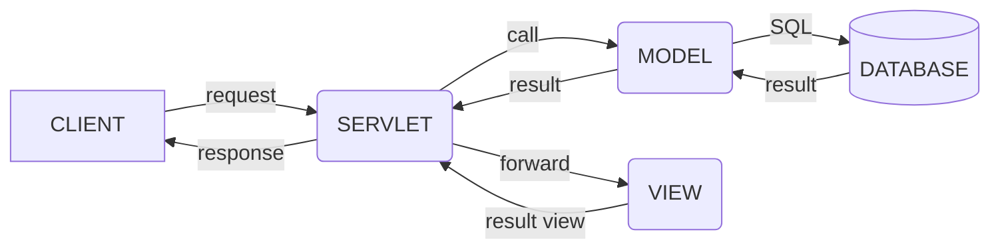

### IOC (Inversion of Control)
- 사용자가 제어의 흐름을 선택하지 않고 특별한 객체에 위임
### DL (Dependency Lookup)
- 컨테이너에서 제공하는 API를 이용하여 사용하고자 하는 빈을 검색
### DI (Dependency Injection)
- 각 클래스 사이의 필요로 하는 의존관계를 빈 설정 정보를 바탕으로 컨테이너가 자동 연결
#### POJO (Plain Old Java Object)
- getter / setter를 가진 단순 자바 오브젝트
- 의존성이 없어 유연.
#### AOP (Aspect Oriented Programming)
- 관점 지향 프로그래밍
- 중복되는 코드 / 공통기능을 한 곳에 보관. 재사용성 극대화.

---
#### Spring Core
- Spring Container. 
- Bean Factory Container는 IOC패턴을 적용하여 객체 구성/ 의존성 처리 등 

#### Spring Context
- context 정보들을 제공하는 설청 파일. 

#### Spring AOP

#### Spring DAO
- Data Acess Object : database에 접근하는 객체.
- Spring JDBC DAO는 추상 레이어를 지원하여 간편화

#### Spring ORM
- Object relational mapping 

#### Spring Web
- Web context module은 Application module에 내장.
- Web 기반의 응용프로그램에 대한 Context를 제공
- Jakarta Structs와의 통합 지원

#### Spring MVC
- Model2 구조 지원
- 전략 인터페이스를 통해 고급 구성 가능
- JSP, Velocity, Tiles , iText, POI 등 View 기술 지원

----
### 원격 프로그램 실행
1. 프로그램 등록
2. URL과 프로그램을 연결
```java
package com.fastcampus.ch2;

import org.springframework.stereotype.Controller;
import org.springframework.web.bind.annotation.RequestMapping;

@Controller  // 1
public class Hello{
 
	@RequestMapping("/Hello") // 2
	public void main(){
		System.out.pringln("Hello");
	
	}
}
```

---
### Maven

#### pom.xml
- Project Object Model 정보를 담고 있는 파일
- 프로젝트 정보 / 빌드 설정 정보 / POM 연관 정보

```java
	<name> // 프로젝트 명
	<url> // 프로젝트 사이트 URL
	<description> // 프로젝트에 대한 설명
	<organization> // 프로젝트를 관리하는 단체 설명

	<groupId> // 프로젝트의 그룹 ID설정
	<artifactId> // 프로젝트 아티펙트 ID
	<version> // 프로젝트의 버전

	<packaging> // 패키징 타입
		// jar, war
	<dependencies> // 라이브러리 의존성 정보 dependency 태그를 묶음
	<dependency> // 각 라이브러리의 정보
	<groupId> // 의존성 라이브러리의 그룹 id
	<artifactId>
	<version>
	
	<scope> // 해당 라이브러리의 이용 범위 지정
		// complie(default) : 모든 클래스 경로에서 사용가능. 컴파일 및 배포상황에서 제공
		// provided : 런타임 시에만 제공. 컴파일 또는 테스트 경로에서만 사용. 배포시에 빠짐
		// runtime : 실행 상황에서만 사용. 컴파일 클래스 경로에x
		// test : 테스트에서만 사용. 종속 프로젝트에 영향 x
		// system : 저장소에서x 직접 관리하는 JAR를 추가. systemPath를 추가 필요
	
	<optional> // 다른 프로젝트에서 이 프로젝트를 의존성 설정을 할 경우 사용할지 결정

```
##### Spring Boot Starter Parent
- 프로젝트에서 사용하는 다양한 라이브러리 간의 버전 충돌 문제 방지
- 의존성 조합간 충돌 문제가 없는 검증된 버전 조합 제공

##### Spring Boot Starter Web
- Spring MVC를 사용한 REST 서비스 개발에 사용

##### Spring Boot Starter Test
- JUnit, Hamcrest, Mockito 를 포함한 스프링 어플리케이션의 테스트 기능 제공


----

### 디자인 패턴
- 특정 문맥에서 공통적으로 발생하는 문제에 대해 쓰이는 재사용 가능한 해결책
- 대표적으로 GoF의 23개 패턴
- 목적에 따라 생성 / 구조 / 행동으로 분류

#### 생성 패턴
- 객체의 생성과 관련된 패턴
- 특정 객체가 생성되거나 변경되어도 프로그램 구조에 영향을 최소화

생성 패턴 | 의도
--- | ---
Abstract Factory| 구체적인 클래스를 지정하지 않고 인터페이스를 통해 연관되는 객체들을 묶음
Builder| 객체의 생성과 표현을 분리하여 객체를 생성
Factory Method| 객체 생성을 서브클래스로 분리하여 위임(캡슐화)
Prototype| 원본 객체를 복사하여 객체를 생성(클론)
Singleton| 한 클래스마다 인스턴스를 하나만 생성하여 어디서든 참조


#### 구조 패턴
- 프로그램 내 자료 구조나 인터페이스 구조 등 설계에 사용
- 클래스나 객체를 조합해서 더 큰 구조를 만듬

구조 패턴 | 의도
----- | ---
Adapter| 클래스의 인터페이스를 어떤 클래스에서든 이용할 수 있도록 반환
Bridge|구현부에서 추상층을 분리하여 각자 독립적으로 변형하고 확장할 수 있도록 함
Composite | 객체들의 관계를 트리 구조로 구성하여 표현. 복합/단일 객체를 구분없이 다룸 
Decorator| 주어진 상황에 따라 객체에 다른 객체를 덧붙임
Facade | 서브 시스템에 있는 인터페이스 집합에 대해 통합된 인터페이스 제공
Flyweight | 크기가 작은 여러 개의 객체를 매번 생성하지 않고 최대한 공유
Proxy | 실제 기능을 수행하는 객체 대신 가상의 객체를 사용해 로직 제어

#### 행동 패턴
- 반복적으로 사용되는 객체들의 커뮤니케이션을 패턴화
- 객체 사이의 알고리즘 또는 책임을 분배하는 방법
- 결합도를 최소화 하는 것이 주 목적

행동 패턴| 의도
---|---
Chain of Responsibillity| 요청을 받는 객체를 연쇄적으로 묶어 처리 개체까지 Chain 을 따라 전달
Command|요청을 객체의 형태로 캡슐화하여 재사용하거나 취소
Interpreter|특정 언어의 문법 표현을 정의
Iterator|컬랙션 구현 방법을 노출하지 않으면서 접근 가능한 방법을 제공
Mediator|한 집합에 속해있는 객체들의 상호작용을 캡슐화하여 새 객체로 정의
Memento|객체가 특정상태로 다시 돌아올 수 있도록 내부 상태를 실체화
Observer|객체 상태가 변할 때 관련 객체들이 그 변화를 전달받아 자동으로 갱신
State|객체의 상태에 따라 동일한 동작을 다르게 처리
Strategy|동일계열의 알고리즘군을 정의하고 캡슐화하여 상호 교환 가능하게함
Template Method|상위클래스에 골격만을 작성하고 구체적 처리는 서브클래스로 위임
Visitor|객체의 원소에 대해 수행할 연산을 분리하여 별도의 클래스로 구성

--- 

### REST API

#### API (Application Programming Interface)
- 응용 프로그램에서 사용할 수 있도록 다른 응용 프로그램을 제어할 수 있게 만든 인터페이스
- 내부 구현 로직을 알지 못해도 정의된 기능을 사용 가능

#### REST (Represental State Transfer)
- 자원의 이름으로 구분하여 해당 자원의 상태를 교환
- 서버와 클라이언트의 통신 방식 중 하나
- HTTP URL를 통해 자원을 명시하고 HTTP Method를 통해 자원을 교환
	- HTTP Method : CRUD

##### Server-Client 구조
- 클라이언트와 서버가 독립적
##### Stateless
- 요청 간에 클라이언트 정보가 서버에 저장되지 않음
- 각각의 요청을 완전히 별개의 것으로 인식하고 처리
##### Cacheable
- HTTP의 캐싱 기능 적용. 
- 대량의 요청을 효율적으로 처리
##### Layered System
- 클라이언트는 서버의 구성과 상관 없이 REST API 서버로 요청
- 서버는 다중 계층으로 구성될 수 있음(로드밸런싱 , 보안요소, 캐시 등)
##### Code on Demand
- 요청을 받으면 서버에서 클라이언트로 코드 또는 스크립트를 전달하여 기능 확장
##### Uniform InterFace
- 정보가 표준 형식으로 전송되기 위해 구성 요소간 통합 인터페이스 제공
- HTTP 프로토콜을 따르는 모든 플랫폼에서 사용 가능하게끔 설계

#### 장점
- HTTP 프로토콜을 사용하는 모든 플랫폼에서 호환
- 서버와 클라이언트의 역할을 명확히 분리
- 여러 서비스 설계에서의 문제 최소화

#### REST API 특징
- REST 기반으로 시스템을 분산하여 확장성과 재사용성을 높임
- HTTP 표준을 따르고 있어 여러 프로그래밍 언어로 구현 가능

#### 설계 규칙
1. 웹 기반의 REST API를 설계할 경우에는 URI를 통해 자원을 표현
2. 자원에 대한 조작은 HTTP Method를 통해 표현
	- URI에 행위가 들어가면 안됨
	- HEADER를 통해 CRUD를 표현하여 동작 요청
3. 메세지를 통한 리소스 조작
	- HEADER를 통해 context-type을 지정하여 데이터 전달
	- 대표적으로 HTML, XML, JSON, TEXT

4. URI 에는 소문자를 사용
5. Resource의 이름이나 URI가 길어질 경우 하이픈을 사용
6. 언더바는 사용하지 않음
7. 파일 확장자를 표현하지 않음
---

### MVC (Model View Controller)
- 어플리케이션을 구성할 때 그 구성요소를 세가지 역할로 구분한 패턴
- 사용자 인터페이스로부터 비즈니스 로직을 분리하여 서로 영향 없이 수정 가능



#### Controller
- Servlet
- Client 요청을 분석하여 Model 호출
- 필요에 따라 request, session 등에 결과data 저장, redirect / forward 방식으로 jsp page 이용 출력
- Model , View 의 정보 O
- ex) 쇼핑몰에서 상품을 검색하면 그 키워드를 컨트롤러가 받아 모델과 뷰에 적절히 입력을 전달

#### Model
- Service / DAO / Java Beans
- Logic 처리를 담당. Controller로 부터 넘어온 data 이용, return
- Model에서는 View와 Controller의 정보를 가지고 있으면 X
- ex) 검색을 위한 키워드가 넘어오면 DB에서 관련 상품의 데이터를 받아 View 에 전달

#### View
- JSP
- 화면처리를 담당. Client 요청에 대한 결과 / controller에 요청을 보내는 화면단
- Model이 가진 정보를 저장 X Model , Controller 의 구성요소 X
- ex) 검색 결과를 보여주기 위해 모델에서 결과 상품 리스트 데이터를 받음

---
#### @RestController
- @Controller에 @ResponseBody가 결합된 어노테이션
- 컨트롤러 하위 메서드에 @ResponseBody 어노테이션을 붙이지 않고도 문자열과 JSON 전송가능
- View 를 거치지 않고 HTTP ResponseBody에 직접 Return 값을 담아 보냄

---

### Get API

#### @RequestMapping
- MVC의 Handler Mapping 을 위해서 DefaultAnnotationHandlerMapping 을 사용
- DefaultAnnotationHandlerMapping 매핑정보로 @RequestMapping 활용
- 클래스와 메서드의 RequestMapping 을 통해 URL을 매핑하여 경로설정. 해당메서드에서 처리

- value : url 설정
- method : GET, POST, DELETE, PUT, PATCH등

- Spring 4.3버전부터는 메서드를 지정하는 방식보다 어노테이션 사용
	- @GetMapping
	- @PostMapping 
	- @DeleteMapping 
	- @PutMapping
	- @PatchMapping
- 별도의 parameter 없이 API 호출

#### @PathVariable
- Get형식의 요청에서 파라미터를 전달하기 위해 URL에 값을 담아 요청하는 바업
```java
	@GetMapping(value="/{variable}")
	public String getVariable1(@PathVariable String variable){
		return variable;
	}
	//  @GetMapping의 {변수}이름과 메서드의 파라미터가 일치해야함
```
```java
	@GetMapping(value="/variable2{variable}")
	public String getVariable2(@PathVAriable("variable")String var){
		return var;
	}
	// 변수명이 다를경우
```

#### @RequestParam
- Get형식의 요청에서 쿼리 문자열을 전달하기 위해 사용되는 방법
- '?' 를 기준으로 우측에 {key}={value} 형태로 전달, 복수 형태로 전달할 경우 & 사용
- request1?name=flature&email=thinkground ....
```java
	@GetMapping(value="/request1")
	public String getRequestParam1(
	@RequestParam String name,
	@RequestParam String email,
	...){
	return name+""+email+...;
	}

	StringBuilder sb = new StringBuilder();
	param.entrySet().forEach(map->{
		sb.append(map.getKey()+":"+map.getValue()+"\n");
	})
	return sb.toString();
	// 어떤 요청값이 들어올지 모를 경우
```

##### DTO 사용
- key와 value가 정해져있지만, 받아야할 파라미터가 많을 경우
```java
	@GetMapping(value="/request3")
	public String getRequestParam3(MemberDTO memberDTO){
	return memberDTO.toString();
	}

	public class MemberDTO{
		private String name;
		private String email;
		private String organization;
	}
```
---

### Post API
- 리소스를 추가하기 위해 사용되는 API

#### @PostMapping
- @RequestMapping + POST method
- 추가하고자 하는 리소스를 http body에 추가하여 서버에 요청
- @RequestBody 이용하여 값을 받는다

---
## Lombok
- 반복되는 메소드를 어노테이션을 사용하여 자동으로 작성해주는 라이브러리
- 대표 Annotation
	- @Getter
	- @Setter
	- @NoArgConstructor
	- @AllArgConstructor
	- @Data
	- @ToString

#### @EqualsAndHashCode
- equals , hashcode 메소드 자동 생성
- equals : 두 객체의 내용이 같은지 equality 비교
- hashcode : 두 객체가 같은 객체인지 identity 비교
- callSuper 속성을 통해 부모 클래스의 필드까지 고려할지 여부 설정

#### @Data
- 앞의 기등들을 모두 추가

---
### Entity(Domain)
- 데이터베이스에 쓰일 column과 여러 엔티티 간의 연관관계를 정의
- 데이터베이스의 테이블을 하나의 엔티니로 생각해도 무방
- 실제 데이터베이스의 테이블과 1:1로 매핑
- 이 클래스의 필드는 각 테이블 내부의 Column을 의미

### Repository
- 엔티티에 의해 생성된 데이터베이스에 접근하는 메소드를 사용하기 위한 인터페이스
- Service와  DB를 연결
- CRUD를 정의하는 영역

### DAO (Data Access Object)
- 데이터베이스에 접근하는 객체 (Persistance Layer)
- Service가 DB에 연결할 수 있게 해주는 역할
- DB를 사용해 데이터를 조회하거나 조작하는 기능

### DTO (Data Transfer Object)
- Value Object , 계층간 데이터 교환을 위한 객체 의미
- VO의 경우 Read Only의 개념

---
## Logback
- Log4j 기반 로깅 라이브러리
- 로그 레벨 설정 가능 (Trace - Debug - Info - Warn - Error)
- 출력 방식 설정 가능
- 설정 파일을 주기적 스캔하여 어플리케이션 중단 없이 설정 변경 가능
- 별도의 프로그램 없이 자체적으로 로그 압축 지원
- 로그 보관 기간 설정 가능

#### 설정
- Classpath에 있는 logback 설정 파일 참조
- Java Legacy, Spring의 경우에는 logback.xml
- Spring Boot 의 경우 logback-spring.xml

##### appender
- Log의 형태 및 어디에 출력할지 설정
- ConsoleAppender : 콘솔에 출력
- FileAppender : 파일에 저장
- RollingFileAppender : 여러개의 파일 순회하며 저장
- SMTPAppender : 메일로 전송
- DBAppender : DB에 저장

##### encoder
- pattern 을 사용하여 원하는 형식으로 로그 표현
```java
<encoder>
	<pattern>
	[%d{yyyy=MM-dd HH:mm:ss.SSS}][%-5level][%thread]%logger%msg%n
	</pattern>
```

##### root
- 설정한 Appender 참조하여 로그의 레벨 설정
- 지역 설정의 경우 logger
```java
<root level="DEBUG">
	<appender-ref ref="INFO_LOG"/>
</root>
```

---
## Validation
- 유효성 검사. 데이터 검증
- 들어오는 데이터에 대해 의도한 형식의 값인지 확인

### Bean Validation / Hibernate Vaildator
- 어노테이션을 통해 데이터를 검증할 수 있게 기능 제공
```java
@Size
@NotNull
@NotEnptu
@NotBlank

@Past
@PastOrPresent
@Future
@FutureOrPresent

@Pattern

@Max
@Min
@AssertTrue / @AssertFalse

@Valid
```
